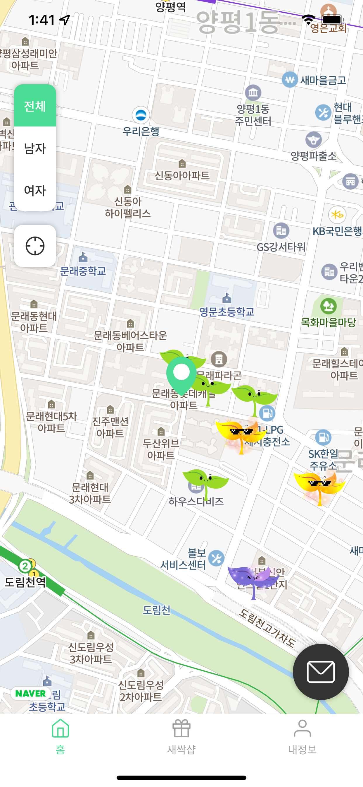
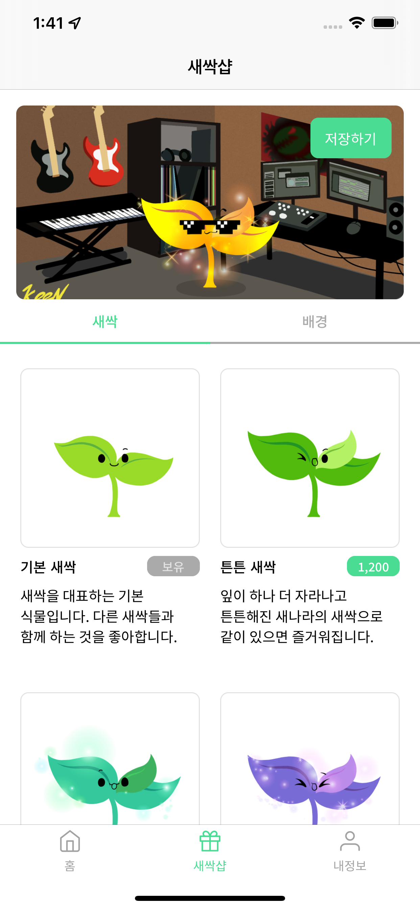
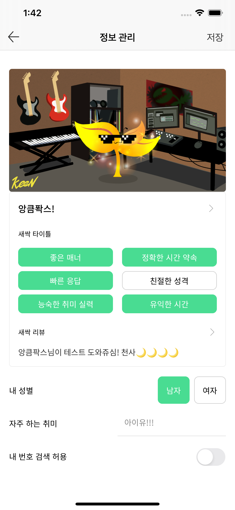
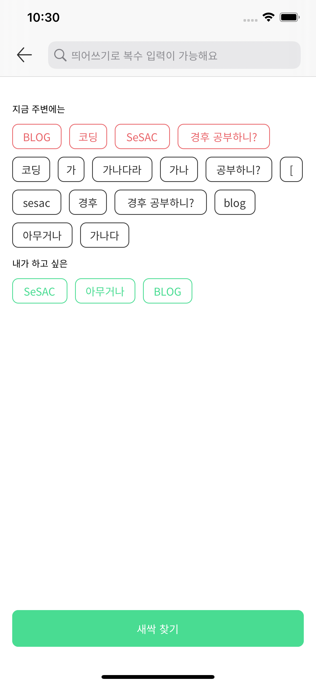
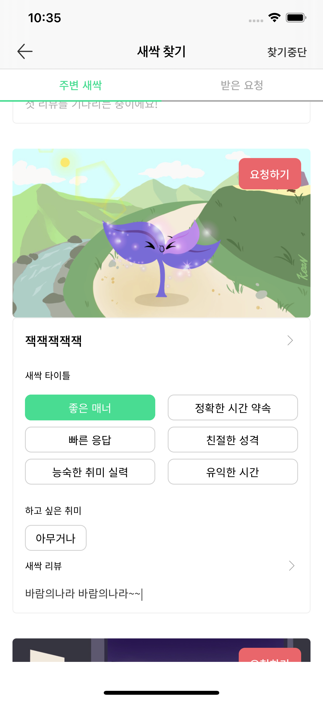
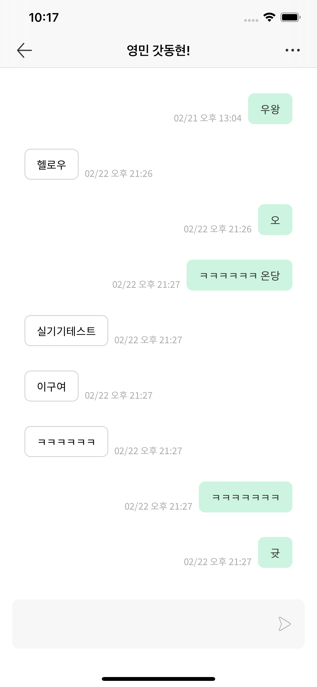
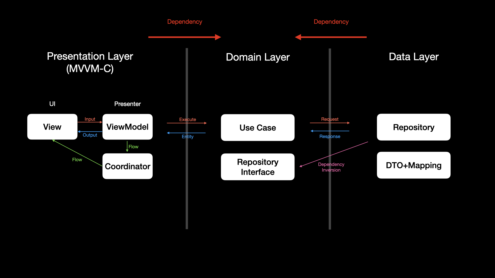
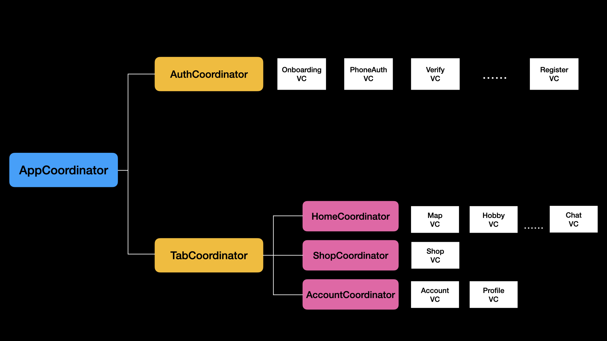

# Friends - Service Level Project

# Overview

<div align = "center">



</div>
<div align = "center">



</div>

- 지도, 위치 기반 취미 공유 친구찾기 앱
- 전화번호 인증, 회원가입
- 지도를 통한 주변 유저 탐색
- 유저 매칭 및 채팅
- 매칭취소, 유저신고, 리뷰
- 인앱결제
- 프로필 수정, 회원탈퇴

---

# Architecture
## iOS-Clean-Architecture

<div align = "center">        
    
</div>

- Presentation Layer = View, ViewModel, Coordinator
- Domain Layer = UseCase, Entities, Repository Interface
- Data Layer = Repository(Network API, DB..), DTO + Mapping

## MVVM Input/Output
```swift
final class ChatViewModel: ViewModelType {
    struct Input {
        let backButtonTap: Driver<Void>
        let moreButtonTap: Driver<Void>        
        let viewWillAppear: Driver<Void>
        let sendButtonTap: Driver<String>
        let messageText: ControlProperty<String>
    }
    
    struct Output {        
        let chatMessages = BehaviorRelay<[ChatItemViewModel]>(value: [])        
        let messageTextViewScrollEnabled = PublishRelay<Bool>()        
        let initializeTextView = PublishRelay<String>()
    }

    // ...
    
    func transform(_ input: Input, disposeBag: DisposeBag) -> Output {
        let output = Output()        
        input.viewWillAppear
            .drive { [weak self] _ in
                self?.useCase.executeSocketConnect()
            }.disposed(by: disposeBag)
        
        input.sendButtonTap
            .drive { [weak self] in                
                self?.useCase.executeSendMessage(chat: $0)
            }.disposed(by: disposeBag)

        // ...
        return output
    }
```

## Coordinator

<div align = "center">        
    
</div>

---

# Framework, Library

- UIKit
- Code-Based UI, Autolayout, SnapKit, 
- RxSwift, RxCocoa, RxRelay
- RxDatasources, RxKeyboard, RxGesture
- Firebase Auth, Firebase Cloud Message
- Moya, SocketIO
- Realm
- SwiftGen, SwiftLint

---

# Issues

### Architecture
- [Repository Interface에 대한 고찰](https://github.com/JD-man/Friends/issues/1)
- [Domain Layer와 Entity에 대한 고찰](https://github.com/JD-man/Friends/issues/6)
- Coordinator 도입 및 의존성 주입
- TabbarController와 Coordinator

### Framework, Library
- [SwiftGen 설치 및 오류](https://github.com/JD-man/Friends/issues/2)
- [SwiftLint 설치](https://github.com/JD-man/Friends/issues/3)
- Moya 사용
- Naver Map 설치 
- SocketIO 설치 및 이슈

### App
- [FCM Token 업데이트 시점](https://github.com/JD-man/Friends/issues/4)
- [View에서 ViewModel로 한번에 여러 값들 넘기기](https://github.com/JD-man/Friends/issues/5)
- [CLLocation과 Repository](https://github.com/JD-man/Friends/issues/7)
- [복잡하게 이루어진 기획상의 화면전환](https://github.com/JD-man/Friends/issues/8)
- [UICollectiionView, RxDatasources를 이용한 태그 및 애니메이션 버그](https://github.com/JD-man/Friends/issues/9)
- TableView의 BackgroundView
- 회원가입시 유저정보를 응답으로 받을 필요성
- 매칭상태를 UserDefault로 저장하는 부분에 대한 맹점
- 채팅뷰의 셀을 1개로 했을때의 문제
- 채팅뷰의 스크롤링
- 전반적인 API 에러처리와 토큰만료
- 인앱결제 도입기

---